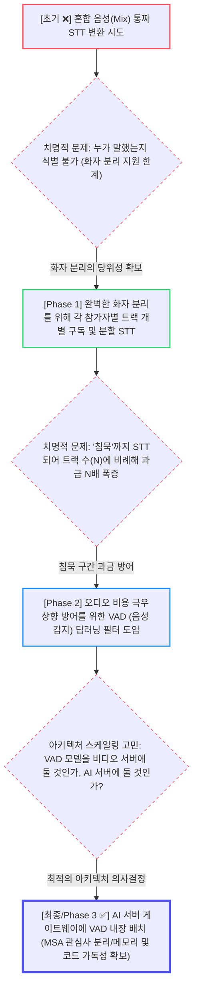

# 🎙️ OnMeet AI 파이프라인 아키텍처 및 진화 스토리

이 문서는 실시간 화상회의의 대본/요약 생성을 총괄하는 OnMeet AI 백엔드의 아키텍처 진화 과정, 비용 최적화 설계, 그리고 모델 선정 배경에 대한 발표/리뷰용 백서(Whitepaper)입니다.

---

## 1. 🚀 도입: 아키텍처 진화 역사와 시각화 (Evolution Flow)

AI 서비스 구축은 실상용화 시 발생하는 **과금 폭탄과 화자 분리 한계**를 해결하기 위해 다음과 같은 거대한 파이프라인 진화를 거쳤습니다.

### 📉 오디오 파이프라인 의사결정 흐름도



### [진화의 구체적 맥락과 뼈를 깎는 의사결정]

**1. 대본의 본질 (통짜 믹스 STT의 포기)**
- **As-Is**: 트래픽 비용 하락을 위해 웹RTC의 모든 사용자 오디오가 합쳐진(Mix) 스트림 1개만을 STT로 넘기려 했습니다.
- **Problem**: 한 번 섞여버린 오디오는 클라우드 모델이 아무리 뛰어나도 "정확히 누가 이 말을 했는지(화자 분리)" 완벽하게 쪼개주지 못하는 치명적인 한계에 부딪혔습니다.
- **해결책**: 화자 분리에 대한 당위성과 정확성을 최우선으로 확보하기 위해, 참가자 각자의 오디오 트랙을 따로따로 분리 구독하여 개별 STT를 타게 구조를 전면 수정했습니다.

**2. 트랙 폭증에 따른 비용 재난과 VAD 방어망**
- **Problem**: 개별 트랙 구독 시 '2명이 말할 때 침묵하는 3~4명의 빈 오디오'까지 모두 클라우드로 전송되면서 STT API 과금이 분당 $0.006 배수로 무한정 폭발하는 파멸적 비용 구조가 드러났습니다.
- **방어 로직**: 비용 폭탄을 끄고자 딥러닝 기반의 **VAD 전처리 필터(`Silero ONNX`)**를 채택해 침묵을 과감히 버리고 "의미 있는 유음(Voice)" 청크만 솎아내게 함으로써 STT 비용을 **최소 30%~70% 이상 방어**했습니다.

**3. 아키텍처 배치 의사결정 (Why AI Service?)**
- **어디에 구현할 것인가?**: VAD 필터를 영상/음성 라우팅 주체인 `video-service`에 접목할지, 아니면 `ai-service`에 둘지 고민했습니다. 비디오 서버에 넣으면 미디어 처리와 AI 딥러닝(ONNX) 스레드 연산이 뒤섞여 **메모리 과부하** 우려가 크며, 인프라 코드와 AI 모듈 혼재로 **코드 가독성과 작업 난이도**가 급증하는 리스크가 있었습니다.
- **결론**: `video-service`는 원시 오디오 청크를 파이프라인(Kafka)에 빠르게 퍼붓는 순수 릴레이 역할만 맡겨 책임을 제한하고, **AI 특성의 VAD 기능은 그 도메인 성격에 완벽히 부합하는 `ai-service` 입구(Gateway)에 배치**했습니다. 이를 통해 MSA 관심사 분리와 극강의 코드 가독성을 깔끔히 달성해 냈습니다.
- **💡 심화 정규화 (Audio Normalization)**: 추가로 VAD 모델 도입 시 마이크 볼륨이 달라도 오류를 내지 않도록, 파형 진폭을 강제로 팽창시켜 밸런스를 맞추는 **PCM 오디오 정규화(Normalization)**를 더해 작은 속삭임까지도 누락 없이 분석하는 초정밀 필터망을 구축했습니다.

### [Phase 2: 원시 대본 묶음에서 구조화된 DB로]
- **As-Is**: 회의가 끝날 때까지 텍스트를 모았다가 S3 클라우드 스토리지에 `.json` 파일 하나로 올려버리던 초기 아키텍처.
- **최종 도입 모델 (Database 1:N 정규화 전환)**: 
  S3 클라우드 업로드/다운로드에서 발생하는 병목 시간과 탐색의 불편함을 없애고자, RDBMS인 MySql의 `transcript`, `transcript_event` 자식 테이블 모델로 **완전 정규화(Normalization)**하여 즉시 Insert 하도록 뒤바꿨습니다. 덕분에 **S3 레이턴시 0화** 및 향후 화자별 통계 확장이 가능해졌습니다.

### [Phase 3: 무지성 텍스트에서 강제적 구조화로]
- **As-Is**: LLM이 줄글 형태로 "회의 내용 요약입니다: ~" 식으로 뱉어내는 텍스트 통짜 적재.
- **최종 도입 모델 (`Strict JSON` 강제 매핑)**:
  요약 전문 처리를 담당하는 Claude 3.5 Sonnet 모델의 **프롬프트 엔지니어링**을 통해 결과를 무조건적인 순수 JSON 객체 포맷으로 출력하게 만들고, 서버가 역직렬화하여 DB의 `keywords`, `action_items` 등 서로게이트 컬럼(Column)에 **'완전한 의미적 구조화 체계'**를 갖춰 적재하는 데 성공했습니다.

---

## 2. 🧠 핵심 모델 선정 과정 및 진화 비교표 (Why this model?)

오디오 파이프라인이 진화함에 따라, 단순히 무의미한 오디오를 밀어 넣던 초기 구조에서 **비용과 성능을 극한으로 최적화한 Multi-LLM 앙상블 체계**로 모델들이 발전했습니다.

### 📊 [Phase별] 음성 파이프라인 모델 진화 요약표

| 진화 단계 (Phase) | 선택된 모델 (과금 포인트) | 적용된 핵심 특징 (Features) | 도입 결과 및 한계점 (Results & Limits) |
|---|---|---|---|
| **기존 (Initial)** | `Cloud STT 1 API` | 전체 인원의 오디오가 섞인 혼합(Mix) 스트림 1개를 STT로 통짜 변환 요청 | ❌ "누가 어떤 말을 했는지" 완벽한 화자 분리 불가능<br>❌ 침묵 구간도 과금되어 비용 낭비 심각 |
| **중간 (Intermediate)** | `whisper-1` +<br>**개별 트랙 분할** | 완벽한 화자 분리를 위해 참가자 트랙 N개를 따로 분리하여 각각 `whisper-1` 호출 | ✅ 완벽한 화자 분리(Diarization) 확보<br>❌ N명의 묵음(Silence)까지 분리 전송되어 **클라우드 고정 과금이 N배로 폭발**<br>❌ 한국어 인식률 및 속도 아쉬움 |
| **최종 (Final ✅)** | `Silero VAD`<br>⬇️<br>`gpt-4o-mini-transcribe` | **[VAD 필터링 + 오디오 정규화]**<br>로컬 메모리에서 가벼운 딥러닝 VAD 모델이 무음을 탈락시키고, 유효 음성만 추출해 최신의 저렴한 오디오 특화 모델로 전송 | 🏆 무음 탈락을 통해 **STT 클라우드 비용 최고 70% 이상 극적 방어**<br>🏆 VAD의 오디오 파형 팽창(정규화) 전처리로 인식 정확도 극대화<br>🏆 `gpt-4o-mini-transcribe`의 압도적 한국어 인식률 및 화자/타임스탬프 정확성 달성 |

위 진화 과정을 통과해 현재 운영 중인 **최적화 파이프라인의 각 모델별 상세 배경**은 다음과 같습니다.

### ① 실시간 전처리 게이트웨이: `Silero VAD (ONNX)`
- **도입 목적**: 과금 API를 향한 불필요한 트래픽(침묵) 차단 및 오디오 정규화.
- **운영 비용**: 백엔드의 내부 `ONNX Runtime` 환경을 사용하므로, 네트워크 I/O나 **추가 클라우드 요금이 0원**입니다.

### ② STT (음성 인식): `gpt-4o-mini-transcribe` (OpenAI API)
- **선택 이유 (vs `whisper-1`)**: 
  초기 테스트 시 `whisper-1` 모델은 한국어 인식률 문제와 화자 분리(Diarization) 기능에 아쉬움이 있었습니다. 반면, 최근 발표된 `gpt-4o-mini-transcribe` 모델은 **한국어 화자 인식 및 타임스탬프 문장 분해 능력이 압도적**입니다.
- **💰 처리 속도 및 비용 효율성**: 
  `whisper-1`이 무거운 분 단위 고정 과금을 요구했던 반면, 4o-mini는 최신의 경량화 아키텍처를 적용하여 뛰어난 퀄리티를 가져감에도 **처리 속도(Latency)가 빠르며, 동등 혹은 그 이상의 비용(달러) 절감 효과**를 가져오는 파이프라인 핵심 동력입니다.

### ③ NLP (구조적 요약): `Claude 3.5 Sonnet` (Anthropic API)
- **선택 이유 (vs `GPT-4o`)**: 
  1~2시간 분량의 아주 긴 대본을 읽을 수 있는 **거대한 컨텍스트(Context window)** 수용력이 필수적이었습니다. 무엇보다 다른 기교 없이 서버가 요구하는 **완벽한 JSON 포맷을 변형 없이 파싱해 내는 지시 수행력(Strict Formatting)** 면에서 타 모델 대비 탁월하게 우수했습니다.
- **💰 운영 비용 효율성**: 
  최고 성능인 `Claude 3.5 Sonnet`은 100만 입력 토큰(1M Input tokens) 당 약 $3 수준으로 방대한 텍스트 스크립트를 밀어 넣고 한 번에 뽑아내는 데 제격이며, 고가의 타겟 모델들 대비 훌륭한 경제적 마진을 유지합니다.

---

## 3. 💻 아키텍처를 관통하는 핵심 코드 라인 시연

실무 PPT나 리뷰 시 다루기 좋은 핵심 코드 영역입니다.

### 🎯 핵심 포인트 1: Kafka를 활용한 완전 비동기 이벤트 분산 처리 (EDA)
실시간 화상회의 미디어를 라우팅하는 `video-service`가 무거운 AI 딥러닝 연산으로 인해 멈추거나 지연되지 않도록(Non-Blocking), **Kafka (비동기 메시지 큐)**를 도입하여 서버 간의 결합도를 완전히 끊어냈습니다.

```java
// [video-service 발행] KafkaMeetingEventPublisher.java
public void publishAudioSegmentReady(AudioChunkReadyEvent event) {
    // 1. 화상 방에서 발생한 사용자 음성 청크를 Kafka Topic에 던지고 즉시 본업 복귀 (Fire & Forget)
    publish("audio-chunk-ready", String.valueOf(event.getRoomId()), event);
}
```
```java
// [ai-service 소비] AudioChunkConsumer.java
@KafkaListener(topics = "audio-chunk-ready", groupId = "ai-service-group")
public void consume(String message) {
    // 2. AI 서버는 자신의 리소스 처리 속도에 맞춰 안전하게 큐(Queue)에서 이벤트를 꺼내어(Pull) 분석 시작
    AudioChunkReadyEvent event = objectMapper.readValue(message, AudioChunkReadyEvent.class);
    sttPipeline.processAudio(event);
}
```
**전달 포인트**: 회의 트래픽이 폭주하더라도 메인 화상 서버에는 단 1ms의 딜레이도 발생하지 않습니다. 수만 건의 이벤트는 Kafka 버퍼(Topic) 메모리에 안전하게 일렬로 쌓이며, AI 서버는 자신의 CPU 한계 내에서 차례대로 소비하므로 **장애 전파 차단 및 극도의 확장성(Scalability)**이라는 마이크로서비스(MSA)의 진정한 이점을 쟁취했습니다.

### 🎯 핵심 포인트 2: 소외되는 참가자 없는 포용성(Accessibility) 확보 - 음성과 채팅의 실시간 병합 정렬 (Redis ZSET)
회의 중에는 도서관, 오픈 스페이스 등 **"음성을 켤 수 없는(채팅 전용)" 참가자**도 필연적으로 존재합니다. 이들의 채팅 텍스트와 다른 사람들의 음성(STT) 대화가 하나의 매끄러운 맥락(Context)으로 회의록에 요약될 수 있도록, 완전히 다른 성격의 두 이벤트(Voice / Chat)를 시간순으로 꿰매는 병합 작업이 필수적이었습니다.

이를 위해 무작위(비동기)로 도착하는 양측의 조각들을 1개의 선형적 대화록으로 합치는 조율자로 **Redis Sorted Set(ZSET)**을 선택했습니다.

```java
// RedisMeetingEventStore.java 의 음성 기록 메서드 (채팅인 appendChat 도 동일한 로직 공유)
public void appendVoice(VoiceSegmentCreatedEvent e) {
    // 1. 각기 다른 시간대에 발생한 이질적 데이터이므로, 발생한 Timestamp를 절대 시계(score)로 통일
    long score = e.getTimestamp() != null ? e.getTimestamp().toEpochMilli() : e.getSegmentStartMs();
    long safeSeq = e.getSeq() != null ? e.getSeq() : 0L; // Unboxing NPE 취약점 방어용 Fallback

    // 2. "순서번호 | 타입(VOICE or CHAT) | UUID | 참여자이름 | JSON데이터" 형태의 통일된 규격 조립
    String member = padSeq(safeSeq) + "|VOICE|" + e.getSegmentId() + "|" + e.getParticipantName() + "|" + json;
    
    // 3. 타임스탬프를 score(오름차순 가중치) 값으로 주어, 삽입 즉시 O(log(N))의 속도로 정렬 보관 (ZADD)
    redis.opsForZSet().add(eventsKey(e.getRoomId()), member, (double) score);
}
```
**전달 포인트**: 음성과 텍스트라는 이질적인 매체를 **"시간(score)"** 이라는 단일 기준점으로 묶어 하나의 맥락 흐름으로 완성시킵니다. 이 Redis ZSET 인메모리 정렬 구조 덕분에, **마이크를 켤 수 없는 참가자의 귀중한 채팅 의견도 소외되지 않고 당당히 최종 회의록의 요약 결과물(Claude LLM)에 기여**하는 진정한 포용성(Accessibility) 통합을 이뤄냈습니다.

### 🎯 핵심 포인트 3: 대규모 인프라 변경 간, 100% 무중단 호환성 (Fallback)
저장소가 S3 클라우드 파일에서 완전히 RDBMS(`transcript_event` 단위 테이블)로 이전되었을 때, 기존 상용 운영 서비스 다운을 막은 생명선 코드입니다.

```java
public TranscriptDocument getTranscript(Long roomId) {
    Optional<Transcript> tsOpt = transcriptRepository.findByRoomIdAndStatusCompleted(roomId);
    
    if (tsOpt.isPresent()) {
        // [신규 설계]: DB에 레코드가 있다면 바로 꺼내서 직접 렌더링
        List<TranscriptEvent> dbEvents = transcriptEventRepository.findAll(...);
        return renderer.renderFromDb(dbEvents);
    } else {
        // [오래된 회의 방어용]: DB 데이터가 없는 구버전 S3 시절 회의 조회라면, 
        // Crash 나지 않고 즉시 예전 역직렬화 조립기(Assembler)를 가동하여 우회 리턴.
        return transcriptAssembler.loadTranscriptFallback(roomId);
    }
}
```
**전달 포인트**: 라이브 중인 운영 DB를 뒤엎는 행위는 매우 위험합니다. DB를 첫 번째 옵션으로 조회하되, 없을 경우 구버전 파이프라인(S3 파싱)을 타도록 이중화된 Fallback 체계를 심어 **배포 시점의 100% 무중단 호환성**을 확보한 귀중한 경험 패턴입니다.

---

## 4. 🧠 3대 핵심 AI 파이프라인 모델 구현체 (VAD / STT / LLM)

"AI 파이프라인이 실제로 코드 상에서 어떻게 맞물려 돌아가는가?"에 대한 3대 핵심 모델의 스니펫입니다.

### ① 실시간 무음 필터망 (VAD): `SileroVadClient.java`
침묵을 걸러내고 과금을 방어하는 첫 번째 관문입니다. 백엔드 메모리에서 가벼운 `ONNX Runtime`을 돌려 오디오 배열의 파형을 직접 계산합니다.
```java
// 딥러닝 추론을 돌려 해당 오디오 청크의 음성 확률(prob) 계산
float prob = runInference(window, state, sr);

if (prob >= threshold) { 
    // 임계값(0.5) 이상이면 유의미한 발화(Speech) 구간 시작으로 캡처
    inSpeech = true;
    lastSpeechEndSample = currentSample + WINDOW_SIZE_SAMPLES;
} else if (inSpeech) {
    long silenceDurationMs = ((currentSample - lastSpeechEndSample) * 1000L) / sampleRate;
    // 지정된 시간 이상 연속으로 침묵하게 되면, 앞선 유음(Voice) 덩어리를 싹독 잘라내어 리스트업
    if (silenceDurationMs >= minSilenceDurationMs) {
        segments.add(new SpeechSegment(startMs, endMs));
        inSpeech = false;
    }
}
```

### ② 음성 인식 처리기 (STT): `OpenAiSttClient.java`
VAD가 예쁘게 잘라준 유음(Voice Segment) 덩어리를 WebClient를 이용해 가장 빠르고 저렴한 4o-mini 모델로 쏘아 텍스트로 치환합니다.
```java
MultipartBodyBuilder builder = new MultipartBodyBuilder();
// 1. VAD가 잘라낸 유음 조각(audioBytes) 삽입
builder.part("file", new ByteArrayResource(audioBytes) { ... }, MediaType.valueOf(mimeType));
// 2. 가성비/인식률 끝판왕 오디오 전용 모델 호출
builder.part("model", "gpt-4o-mini-transcribe"); 
builder.part("response_format", "text"); 

return webClient.post()
        .uri(apiUrl)
        .header("Authorization", "Bearer " + apiKey)
        .body(BodyInserters.fromMultipartData(builder.build()))
        .retrieve()
        .bodyToMono(String.class) // 빠른 비동기(Mono) 텍스트 획득
        .block();
```

### ③ 요약 및 구조화 파서 (LLM): `ClaudeSummarizerClient.java`
거대한 대본 텍스트를 던져주고, 우리 데이터베이스 스키마와 1:1로 일치하는 JSON 객체로 강력하게 포맷팅하는 단계입니다.
```java
// 1. 프롬프트 엔지니어링: "순수 JSON 포맷 이외의 텍스트는 절대 금지"
String prompt = String.format("""
    You MUST output ONLY a valid JSON object matching this exact schema:
    {
      "description": "Overall summary of the meeting",
      "keywords": ["important", "keywords"],
      "decisions": ["Any decisions made"],
      "actionItems": ["Who needs to do what"]
    }
    Transcript:
    %s""", transcript);

// 2. 응답 획득 후 파싱 검증 (Validation) 절차
String text = extractContent(responseBody);

// Claude가 내뱉은 JSON 스트링이 우리 내부 DTO 규격과 맞지 않으면 즉시 파싱 크래시(Exception) 유도
// 이를 통과해야만 완벽한 정규화 DB 컬럼에 삽입될 자격이 주어짐
om.readValue(text, SummaryResult.class); 
```

---

## 5. 💡 종합 결론 (Takeaway)

이번 AI 서비스 구축은 단순히 "OpenAI 연동"에 그치지 않고, 아래와 같은 가치 창출을 이루어냈습니다:

1. **지갑을 지킨 아키텍처**: 침묵으로 나가는 무지성 클라우드 과금을 로컬 `VAD Onnx` 도입과 `PCM 오디오 정규화`를 통해 완벽히 방어.
2. **다중 LLM 조율 앙상블 체계**: 로컬 최단 딜레이(VAD) + 오디오 청취 특화(`gpt-4o-mini`) + NLP 구조화 특화(`Claude`) 등 상황에 맞는 가장 뾰족하고 저렴한 무기 3가지를 조립해 가성비 최상의 파이프라인 개설.
3. **기술부채 없는 튼튼한 마이그레이션**: 옛날 회의의 원문 S3 접근과 신규 정규화 DB 조회를 하나의 API(`Fallback`)로 포장시켜 기존 사용자 경험을 온전히 지켰습니다.
